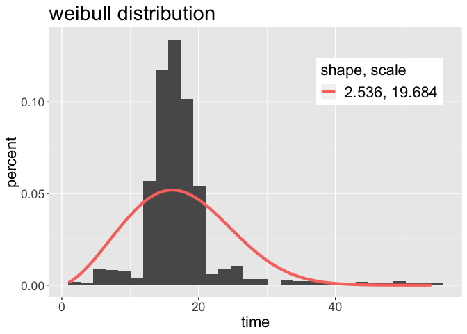
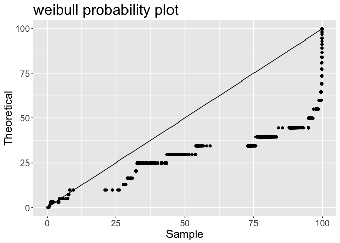
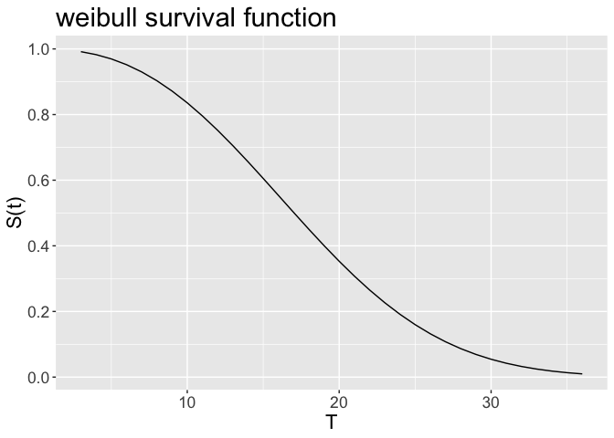
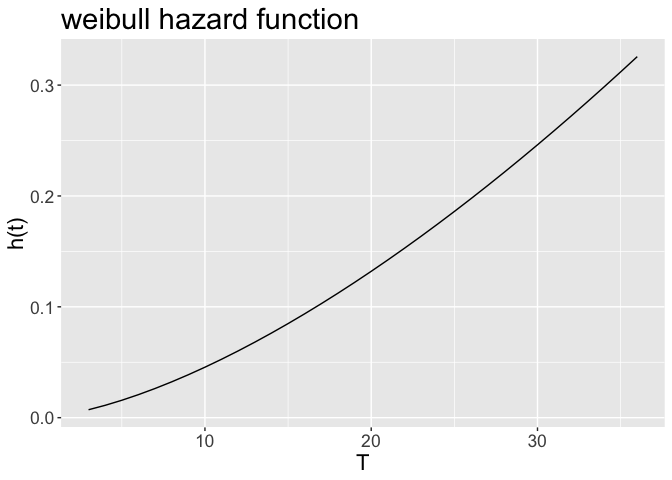
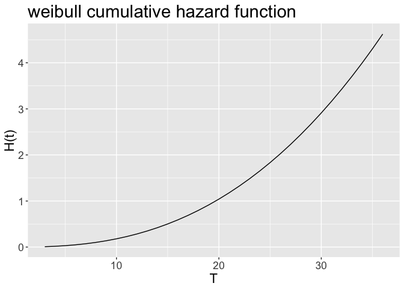

<!-- README.md is generated from README.Rmd. Please edit that file -->
parmsurvfit
===========

This package executes simple parametic models for right-censored survival data. Functionality emulates capabilities in Minitab, including fitting right-censored data, assessing fit, plotting survival functions, and summary statistics and probabilities.

Installation
------------

You can install parmsurvfit from github with:

``` r
# install.packages("devtools")
devtools::install_github("apjacobson/parmsurvfit")
```

Examples
--------

``` r
library(parmsurvfit)
```

Fitting data and assessing fit:

``` r
fit_data(data = firstdrink, dist = "weibull", time = "age")
#> Fitting of the distribution ' weibull ' on censored data by maximum likelihood 
#> Parameters:
#>        estimate
#> shape  2.536106
#> scale 19.684061
plot_density(data = firstdrink, dist = "weibull", time = "age")
```



``` r
plot_ppsurv(data = firstdrink, dist = "weibull", time = "age")
```



``` r
compute_AD(data = firstdrink, dist = "weibull", time = "age")
#> [1] 315.5693
```

Survival functions:

``` r
plot_surv(data = firstdrink, dist = "weibull", time = "age")
```



``` r
plot_haz(data = firstdrink, dist = "weibull", time = "age")
```



``` r
plot_cumhaz(data = firstdrink, dist = "weibull", time = "age")
```



Summary statistics and probabilities:

``` r
surv_prob(data = firstdrink, dist = "weibull", x = 30, lower.tail = F, time = "age")
#> P(T > 30) = 0.05439142
surv_summary(data = firstdrink, dist = "weibull", time = "age")
#> shape        2.536106
#> scale        19.68406
#> Log Liklihood    -3170.779
#> AIC      6345.557
#> BIC      6355.373
#> Mean     17.47135
#> StDev        7.380763
#> First Quantile   12.04374
#> Median       17.03536
#> Third Quantile   22.38974
```
